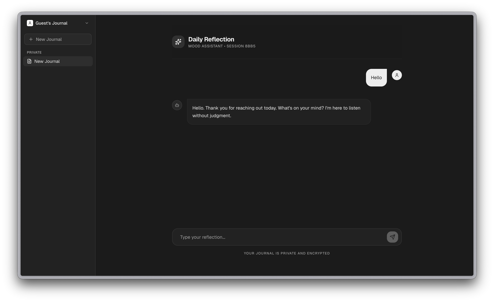

# Mood Journal - AI Reflection Space



A clean, minimal, and empathetic AI-powered mood journal designed with a Notion-inspired aesthetic. Built for deep self-reflection and privacy.

## ✨ Features

- **AI Empathy:** Powered by Google Gemini. Deep listening without generic medical disclaimers.
- **Notion Aesthetic:** Premium dark mode, glassmorphism, and minimal typography.
- **Secure Auth:** Full authentication flow via Supabase (Sign In/Up).
- **Guest Mode:** Quick anonymous access for instant testing without registration.
- **Real-time Sync:** Instant updates across sessions via Supabase Realtime.
- **Fully Responsive:** Seamless transitions between desktop and mobile.
- **Live Deployment:** Ready for production with optimized builds.
- **Privacy First:** Secure data isolation using RLS policies.

## 🛠 Tech Stack

- **Framework:** [Next.js 15](https://nextjs.org/) (App Router)
- **Styling:** [Tailwind CSS 4](https://tailwindcss.com/) + [Shadcn UI](https://ui.shadcn.com/)
- **Backend/Auth:** [Supabase](https://supabase.com/)
- **AI Engine:** [Google Gemini API](https://ai.google.dev/)
- **Icons:** [Lucide React](https://lucide.dev/)

## 🚀 Quick Start

1. **Clone & Install**
   ```bash
   git clone https://github.com/soroqn1/Mood-Journal.git
   cd mood-journal
   npm install
   ```

2. **Environment Setup**
   Create a `.env.local` file:
   ```env
   NEXT_PUBLIC_SUPABASE_URL=your_url
   NEXT_PUBLIC_SUPABASE_ANON_KEY=your_key
   GEMINI_API_KEY=your_gemini_key
   ```

3. **Database Setup**
   Run the following in your Supabase SQL Editor to enable chat features:
   ```sql
   -- Create tables and RLS policies (see docs/setup.sql for full schema)
   ```

4. **Run Development**
   ```bash
   npm run dev
   ```

## 🎨 Design Principles

- **Minimalism:** No unnecessary buttons or distractions.
- **Focus:** Your thoughts are at the center of the experience.
- **Fluidity:** Smooth animations and instant interactions.

---
*Created with focus on mental well-being and clean code.*
